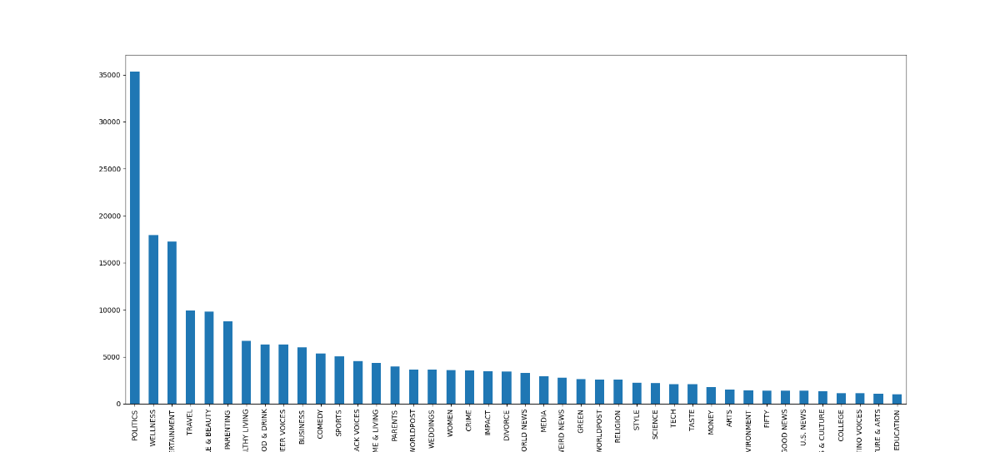
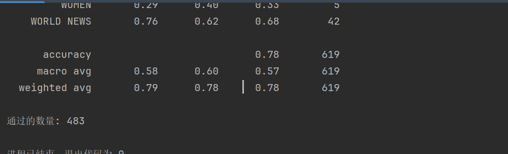

# 新闻分类任务

## 数据集描述

- 每条记录包含以下属性：（category、headline、authors、link、short description、date）
- 其中现有数据集分类如下：
    

## 数据处理流程

- 1. 首先是对 link 进行正则化提取，提取出其中与新闻内容相关部分，是为 data[′link − info′]
- 2. 其次对新闻简介进行一些数据清洗工作，比如去除特殊的字符数字，接着去除其中的停用词，使得保留的内容信息更加有效，当然还对数据进行了词形的还原，便于后续处理。
- 3. 接着将预处理好的简介与标题以及处理好的 link 进行拼接。

## 分类模型选择

- 分类模型选择了朴素贝叶斯模型和逻辑回归模型，但经过实验下来，朴素贝叶斯速率较快但准确率不如逻辑回归模型。代码中对两者均进行了保留，注释掉其中一个，恢复另一个即可。
- 使用训练数据集进行训练，而后对测试数据集进行测试
- 选取 0.05 的数据作为测试数据，计算得出准确率约为 0.78

## 运行说明

将test.py中json文件替换为你自己的测试样例即可

## 最终结果

模型已经保存为 model.pkl，若未保存可运行 train.py 进行重新训练，将 test.py 中 json 文件替换为你自己的测试样例运行 test.py 即可进行测试。
最终结果如下：

测试集上准确率：0.7802907915993538

测试通过数量：483# News_Category
